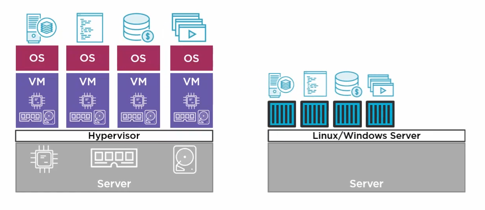
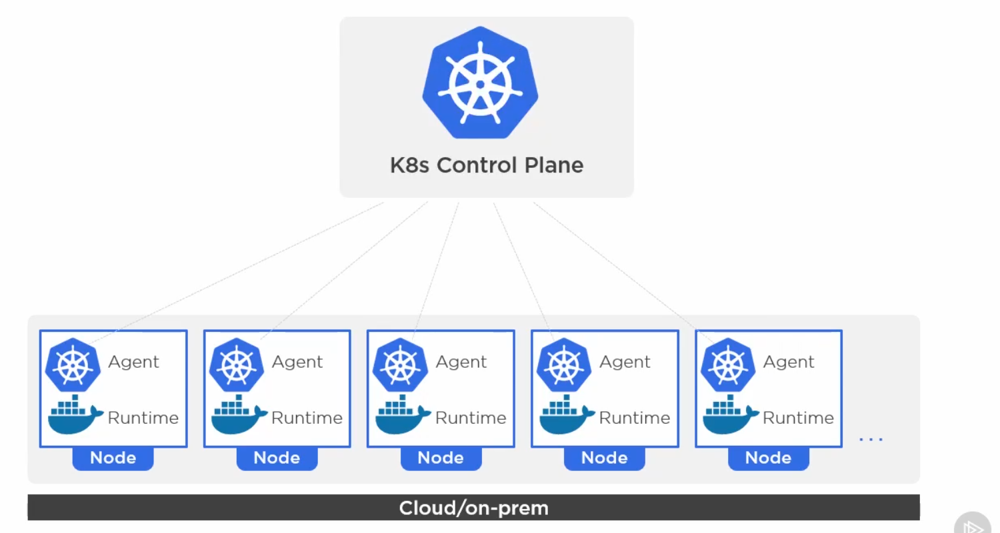
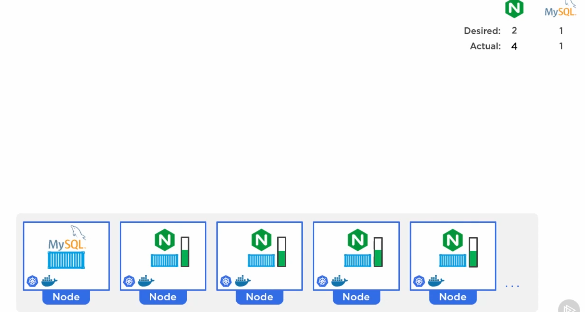
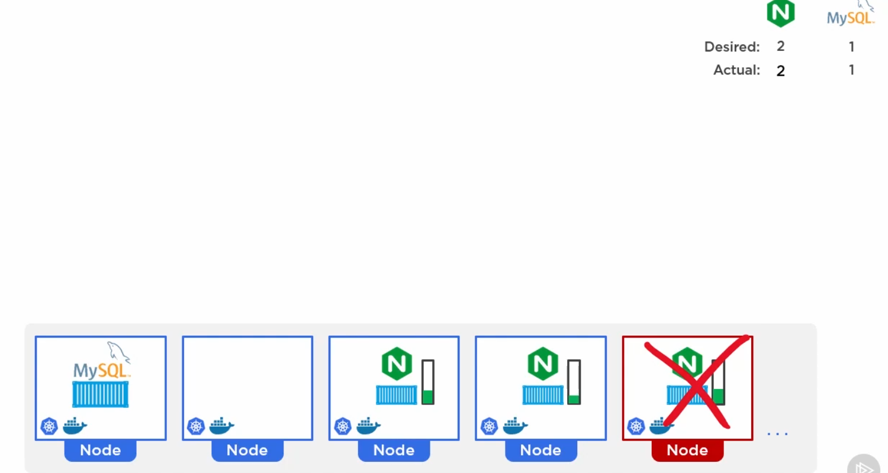
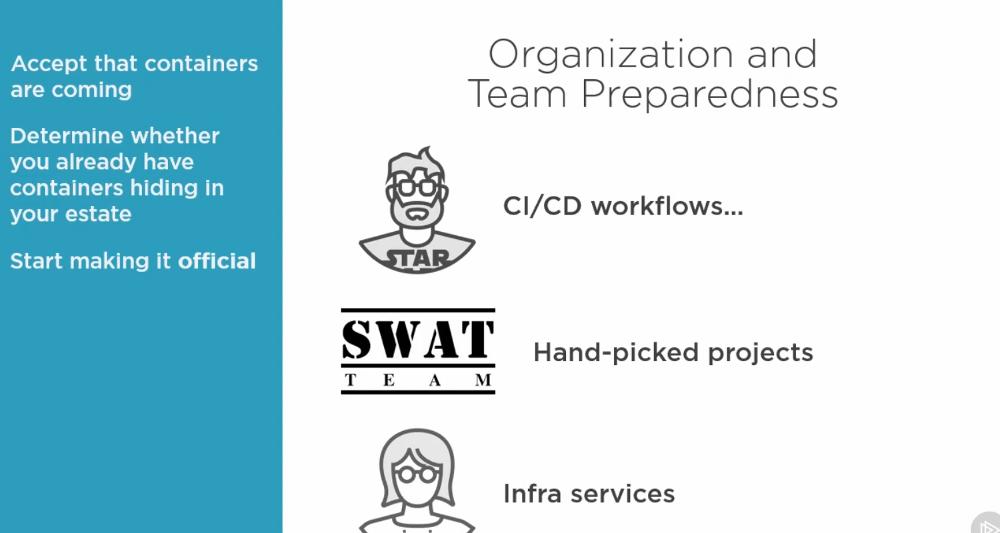
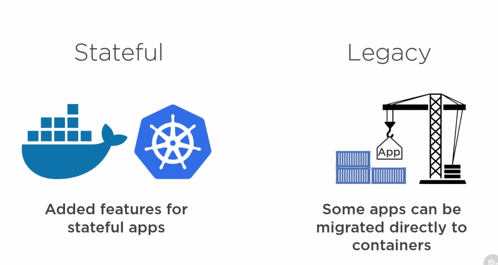

# [Docker and Kubernetes: The Big Picture](https://app.pluralsight.com/library/courses/docker-kubernetes-big-picture/table-of-contents)

> Docker and Kubernetes are transforming the application landscape - and for good reason. This course is the perfect way to get yourself – and your teams – up to speed and ready to take your first steps.

## Agenda

### Containers Primer

Unlike the traditional virtualization model, where each virtual machine shares a slice of the server resources and requires a seperate OS install, the container model shares secure slices of the OS.  This results in fewer resources wasted on OS overhead and maintenance.

Containers are not intended as a replacement for virtual machines, and often work side by side.

### Docker

The company (Docker, Inc.) and technology (Docker project) are closely linked, but are not the same.  

- Docker, Inc. is a San Francisco technology startup and the primary sponsor of the Docker project.
  - Responsible for kicking off the modern container technology craze.
- Docker is an open source technology that makes running apps inside of containers really easy.
  - Community Edition (CE)
    - Open source
    - Numerous contributors
    - Quick release cycle
  - Enterprise Edition (EE)
    - Slower release cycle
    - Additional features
    - Official support
  - Provides the core for starting and stopping containers.
  - Key to building modern cloud native microservices design.

Managing containers at scale can be done with Docker Swarm or Kubernetes.

### Kubernetes

All about managing contanerized applications at scale.  A Kubernetes cluster can be just about anywhere.

The word "kubernetes" is greek for helmsman.

Kubernetes is an open source project that came out of Google, and is now part of the Cloud Native Computing Foundation.  It is backed by most major cloud players and IT vendors.  It is available on all good cloud platforms, and almost everyone is behind it.

Kubernetes is less concerned about low level container operations (that would be managed by Docker), and is intended to manage high level operations such as container scaling, deploying, healing, and updating.  Think of it as a conductor for a symphony of containers, issuing commands to Docker for managing containers.

Kubernetes allows apps to be decoupled from any underlying environment, enabling apps to be moved between cloud providers and/or on premises.

### Thriving in a Container World

Individual preparedness relies on two factors:

1. Knowledge
1. Experience

- Docker Desktop can be used to gain experience working with Docker and Kubernetes on a local machine.
- Numerous cloud services such as Azure, AWS, and Google Cloud offer Docker and Kubernetes services.
- Online sources such as Play-With-Docker and Play-With-Kubernetes are also available.

Organization preparedness starts with acceptance, containers are coming!  The organization needs to face reality.  

- Look at how and where containers might be able to improve the business.
- Determine whether or not containers are already hiding in your estate.
- Start thinking and talking about good areas to use containers.
  - CI/CD workflows are often a good start.
  - Hand picked projects that are a good fit for testing containers.
  - Infrastructure and operation services shouldn't be ignored.
- Start with specialist teams and projects.
- Think about bidgets and who is paying for it.

Containers are coming, and soon they'll be everywhere.

### Suitable Workloads

Common question about containers is whether or not they can be used for stateful applications, or just stateless.  Both Docker and Kubernetes are able to handle stateful applications, but really excel at stateless.

Stateful

- Has to remember stuff (such as a database)

Stateless

- Doesn't remember stuff (such as a web server)

It is possible to deploy some of our legacy applications dirctly inside containers, but that is not the ultimate end goal.  We should be re-thinking and refactoring our applications when containerizing them.

Low hanging fruit for containerization includes stateless and new/greenfield applications.

Containers can do stateful aplications, but these kinds of workloads are harder.  Both Docker and Kubernetes are able to handle these workloads now.

### Enterprise and Production Readiness

### A Word on Orchestration

### What Next
