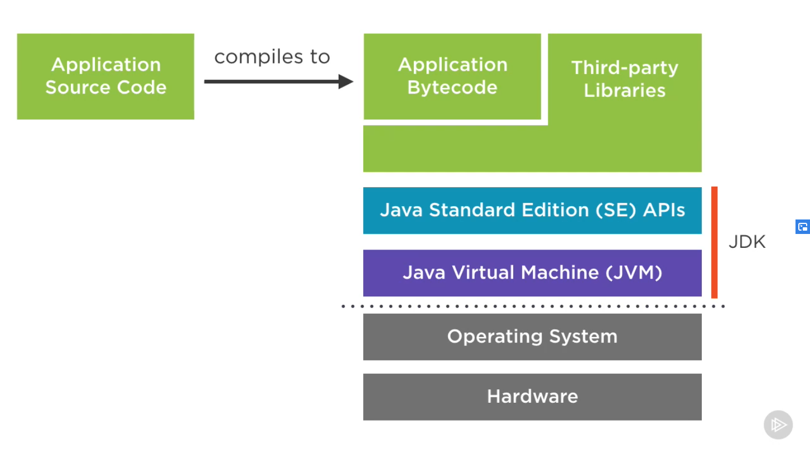
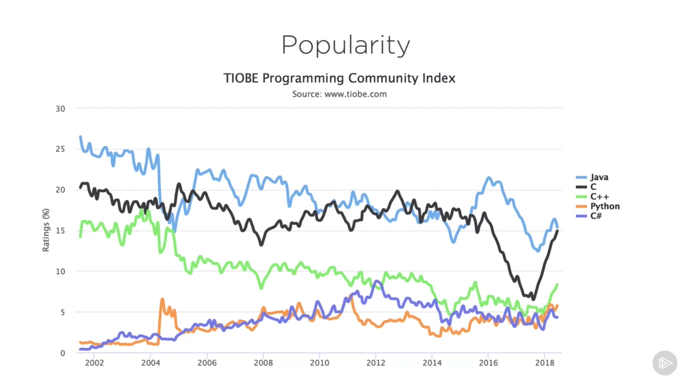
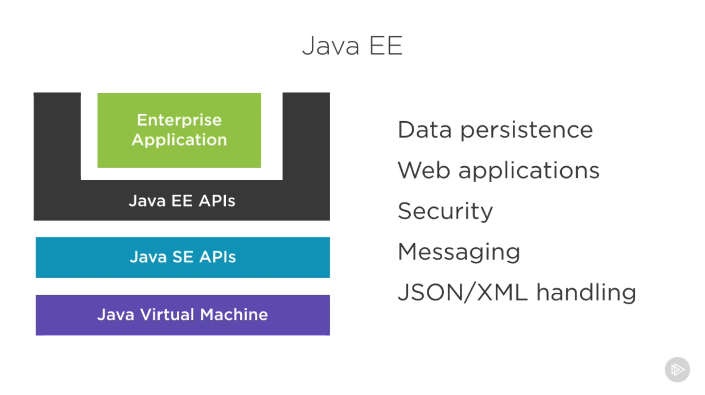
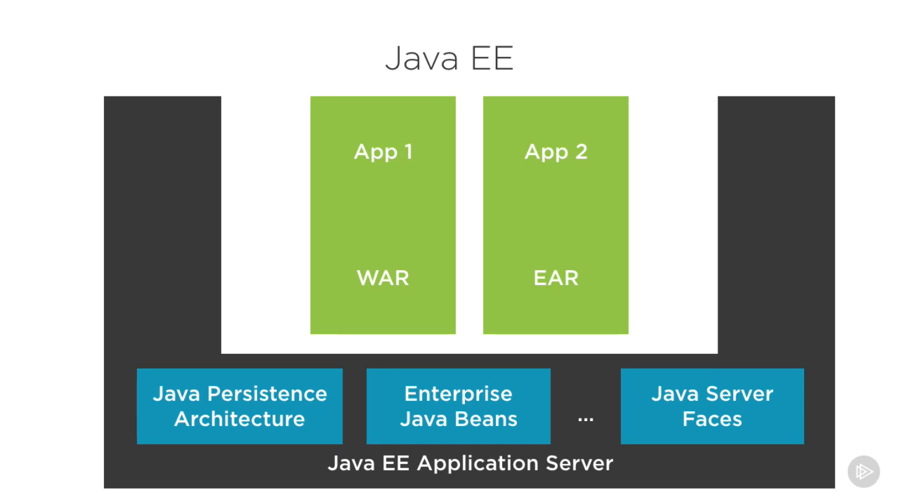
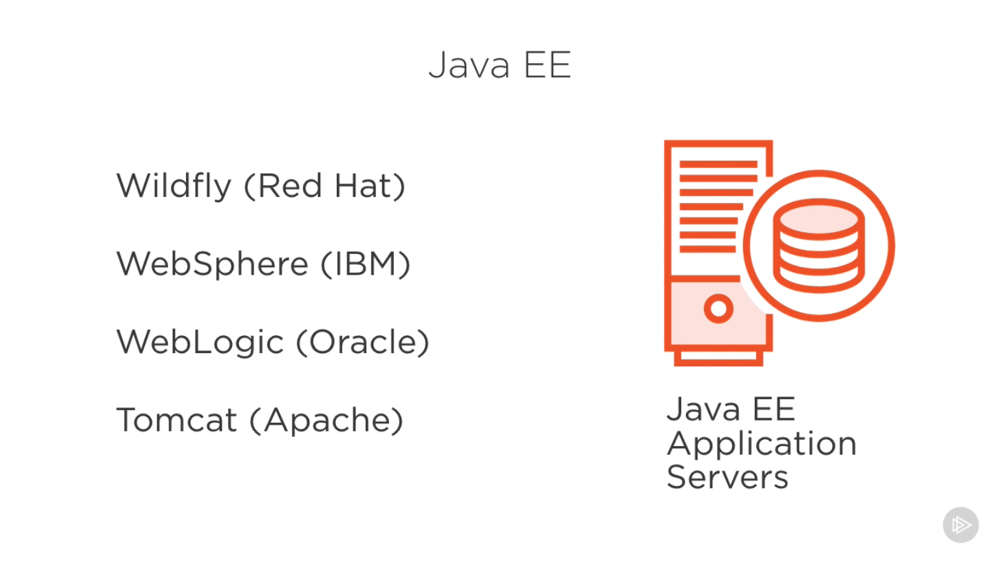
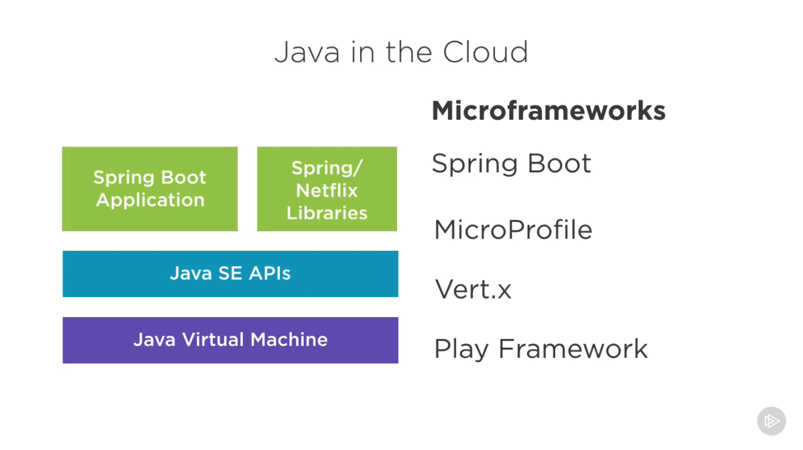
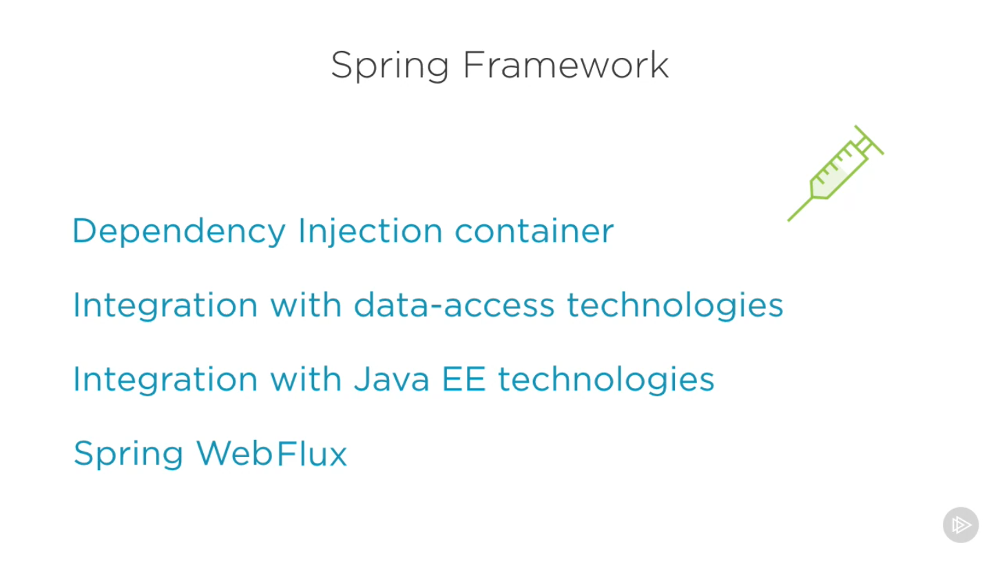
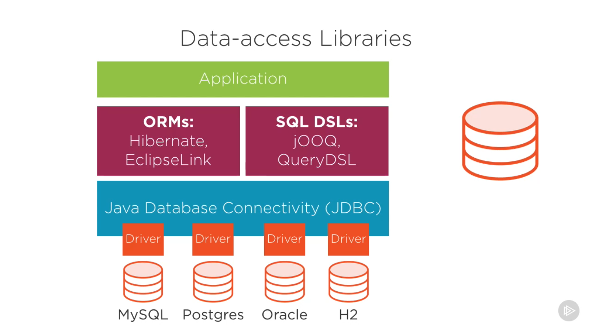

# [Modern Java: The Big Picture](https://app.pluralsight.com/library/courses/modern-java-big-picture/table-of-contents)

>Java is one of the most widely-used development platforms today. This course will teach you the basics of Java, what it looks like, how it is run, and help you decide whether or not it is right for you. 

## Agenda

### Introducing the Java Platform

#### Common Misconceptions

- No relation between Java and JavaScript in either a technical or business sense.
  - Java belongs to Oracle
- Java is no longer a technology installed onto browsers.

#### Defining the Java Platform

- There is more to the Java Platform than just the programming language.
  - Programming language
  - Runtime environment
  - Standard library
- These pieces of the platform are bundled together into the Java Development Kit (JDK)

### Adopting Java

#### Portability

- Java applications should be able to run on any platform (OS/Hardware)
  - Write Once, Run Anywhere (WORA)
- JVM for each OS/architecture
- Bytecode is portable
- Java SE APIs platform-agnostic
- Optimized for readability
  - Reading code is more important that writing code
  - Maintainability over tersness

Java is quite conservative regarding new features

- 'First do no harm'
- Developer producivity
- Maintaining simplicity

Java has a large focus on backwards compatibility and long term support.

- Exisiting code on new JVMs
- Controlled deprecation
- Maintaining simplicity

#### Openness

Java has an open specification process driven by the Java Community Process (JCP)

- Specifies the platform
- Vendor and community participation

There are man non-Oracle implementations: IBM, Eclipse, etc.

The Oracle reference implementation of Java is hosted as an open source project.

- Known as the OpenJDK project
- Publishes GPL 2 licensed binaries
- Experimental subprojects

#### When and Why

Java is an incredibly popular language.

Java has been popular for building -

- Web applications
- Backend services
- Data intensive back-end services

Java offers a very scalable application model -

- Heigherarchical and structured codebases
- Established coding practices
- Strong tooling
- Wealth of libraries

Other benefits -

- Strongly typed
- Automatic memory management
- Garbage collection
- Mutli-threading

#### When is Java Not Right

- Real-time systems
- Tight OS integration
- Quick prototyping
- For developers who want cutting-edge languages

### Types of Java Applications

#### Desktop

There are three toolkits available for Java GUI development -

1. AWT
1. Swing
1. JavaFX (OpenJFX)

#### Enterprise

Enterprise Java is best known by the name Java EE, or Java Enterprise Edition.  It provides a set of interoperable enterprise APIs for common enterprise tasks.

Java EE has been donated by Oracle to the Eclipse Foundation and renamed to Jakarta EE.

#### Cloud

Traditional Java EE applications do not fare well in cloud environments.  Microframeworks are used to target cloud native applications.

### Popular Libraries

- Spring Framework

#### Utility

- Google Guava
  - Additional collections
  - Caching
  - IO Helpers
- Apache Commons
  - Collections
  - CSV
  - IO
- Apache Log4J
  - Structured application logging

#### Distributed Systems

- Netty
  - High performance networking
- Akka
  - Actor model for concurrency
  - Clustering and distribution
- RxJava
  - Reactive programming
  - Async and event-based model
- Apache Camel
  - Enterprise application integration
  - Many transports nad connectors

#### Data Access

### Practices and Common Tools

#### IDEs

- Eclipse
  - Open source IDE hosted at Eclipse Foundation
- IntelliJ
  - Commercial IDE created by JetBrains
  - Community edition available

#### Unit Testing

- JUnit
- Mockito

#### Build Tools

- Maven
  - Define builds in XML format
- Gradle
  - Define builds in Groovy scripts

#### Continuous Integration and Quality Control

- Jenkins
- Checkstyle
- Spotbugs
- PMD
- SonarQube

### Alternative JVM Languages

#### Why

- Productivity
- Familiarity
- Different Paradigms

### Languages

- Groovy
  - Dynamic scripting langiage for the JVM
  - Interpreted or compiled
  - Opt-in type system
  - Concise but still close to Java
- Scala
  - Combines Object Oriented Programming with Functional Programming
  - Compiled language
  - Extensive type system
  - Akka, Spark written in Scala
- Kotlin
  - Designed as a 'better Java' by JetBrains
  - Seamless Java interop
  - Endorsed by Google for Android Development
  - Also runs in browser (compiles to JavaScript)